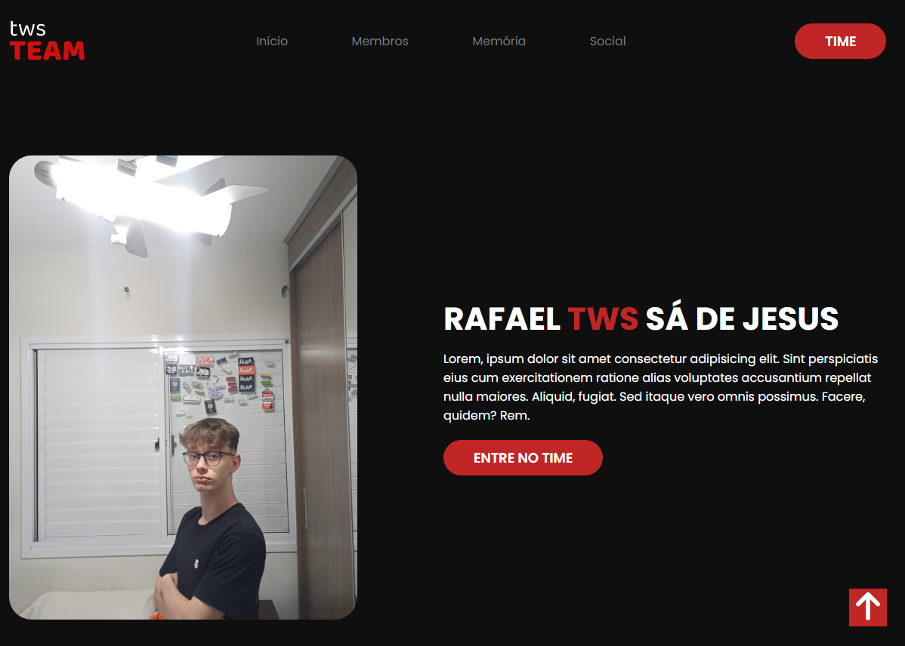

# TWS Team

## Criei este site para treinar e ele contém várias funcionalidades
Este site é de amigos, para mostrar nosso grupo em formato de site e contém certas funcionalidades:
- Jogo da Memória;
- Responsível para celular;
- Cards com imagens e descrição de cada pessoa;

## Linguagens utilizadas:

    
    
    

 
